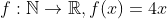
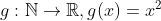
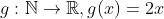

# 5. Übung zur Vorlesung Algorithmen  

## 1 - Asymptotische Laufzeiten
Geben Sie für die folgenden Aussagen jeweils an, ob diese wahr oder falsch sind.
Beweisen Sie wahre Aussagen analog zum Beweis aus der Vorlesung.
Wählen Sie  und  möglichst minimal.

1.  Sei  und .
    1. Gilt ?
    2. Gilt ?
2.  Sei  und .
    1. Gilt ?
    2. Gilt ?

Nutzen Sie bei den Beweisen neben den üblichen Regeln für + und · nur die folgenden Regeln.

  

Geben Sie bei Ungleichungen an, welche der beiden Regeln Sie verwendet haben.
Sie können außerdem nutzen, dass für jede natürliche Zahl  gilt.

Bitte laden Sie ein Foto Ihrer Beweise im Ordner `solution` hoch.
