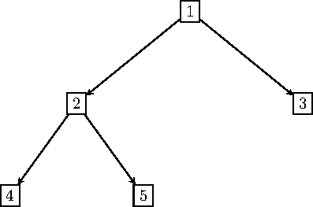

# 6. Übung zur Vorlesung Algorithmen

## 1 - Suchen mittels Rekursion

Implementieren Sie die Methode `contains` in den Klassen `ArrayList` und `SLList` mit Hilfe von Rekursion. Die Methode muss dabei nicht selbst rekursiv sein, sie können auch eine rekursive Hilfsmethode verwenden.

## 2 - Bäume

In dieser Aufgabe sollen Sie sich mit binären Bäumen beschäftigen. Ein Baum ist eine Datenstruktur ähnlich zu einer Liste. Wie eine verkettete Liste, besteht ein Baum aus Knoten. Im Unterschied zu einer Liste hat ein Knoten bei einem binären Baum zwei Nachfolger. Die Nachfolger bezeichnet mal als _linken_ und _rechten Nachfolger_. Ein Baum hat einen ausgezeichneten Knoten, der als _Wurzel_ bezeichnet wird und der “Anfang” des Baumes ist. Wie eine Liste, kann auch ein Baum leer sein. Die Knoten, die keine Nachfolger haben, werden als _Blätter_ bezeichnet. Knoten, die keine Blätter sind, werden als _innere Knoten_ bezeichnet.

Das folgende Bild stellt einen Baum dar. Der Knoten mit der Beschriftung `1` ist die Wurzel des Baumes. Die Knoten mit den Beschriftungen `1` und `2` sind innere Knoten des Baumes. Die Knoten mit den Beschriftungen `4`, `5` und `3` sind Blätter des Baumes.

- Implementieren Sie eine Klasse `BinTreeNode`, die einen Knoten in einem binären Baum darstellt. Implementieren Sie außerdem eine Klasse `BinTree` zur Darstellung eines Baumes. Jeder Knoten soll einen Wert vom Typ `int` enthalten.

- Implementieren Sie die folgenden Objektmethoden in der Klasse `BinTree` mit Hilfe von Rekursion. Dabei muss die Methode nicht selbst rekursiv sein, sie können auch eine rekursive Hilfsmethode verwenden.

  - Die Methode `countNodes` liefert die Anzahl der Knoten in einem Baum.

  - Die Methode `sum` liefert die Summe aller Einträge in einem Baum.

  - Die Methode `entries` liefert alle Einträge im Baum in einer Liste zurück.
    Die Methode soll dabei die Knoten in der Reihenfolge ausgeben, wie sie entsteht, wenn man den Baum "platt drückt". Für den Beispiel-Baum würde man zum Beispiel die Reihenfolge `4`, `2`, `5`, `1`, `3` erhalten.
