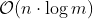

# 8. Übung zur Vorlesung Algorithmen

## 1 - Binäre Suche

In der Vorlesung haben wir die Methode `binarySearch` mit Hilfe einer Schleife implementiert. Implementieren Sie mit Hilfe von Rekursion die folgende Methode.

```java
static boolean binarySearchRec(final int[] array, final int value)
```

## 2 - Summe mittels _Divide and Conquer_

Implementieren Sie mit Hilfe von _Divide and Conquer_ die folgende Methode, welche die Summe der Zahlen im Array berechnet.

```java
static int sum(final int[] array)
```

- Haben Sie die Methode mit einer Schleife oder mit Rekursion implementiert? Begründen Sie Ihre Wahl.


## 3 - Enthält-alle

Implementieren Sie die folgende Methode.

```java
static boolean containsAll(final int[] array1, final int[] array2)
```

Die Methode überprüft, ob alle Einträge in `array1` auch in `array2` vorhanden sind.
Gehen Sie davon aus, dass `array2` sortiert ist.
Die Laufzeit Ihrer Methode soll im _worst case_ in  liegen, wobei `n` die Länge des Arrays `array1` und `m` die Länge des Arrays `array2` ist.
